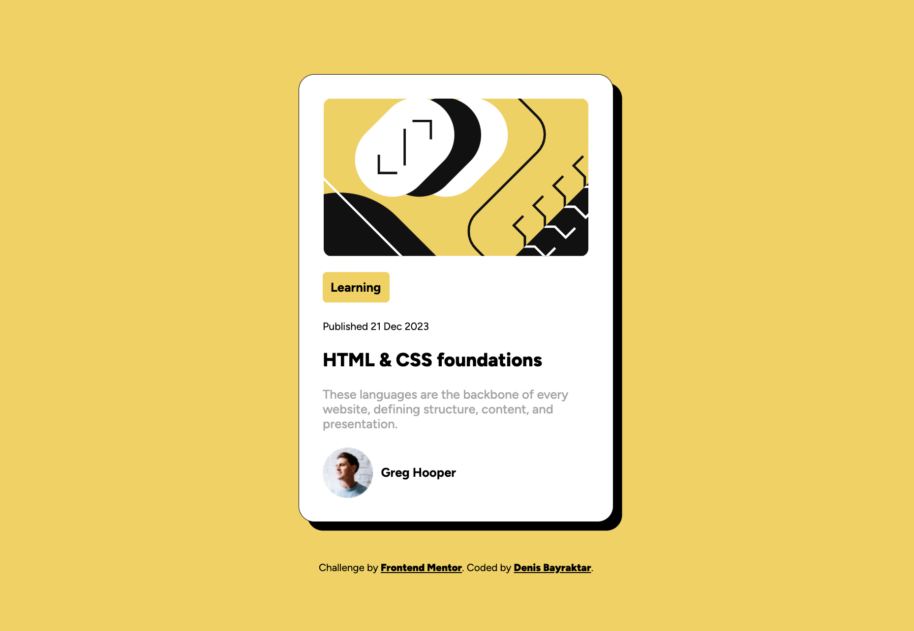

# Frontend Mentor - Blog preview card solution

This is a solution to the [Blog preview card challenge on Frontend Mentor]. Frontend Mentor challenges help you improve your coding skills by building realistic projects. 

### Screenshot

### Links

- Live Site URL: https://denis-blog-preview-card.netlify.app/

### Built with

- Semantic HTML5 markup
- CSS custom properties
- Flexbox
- CSS Grid
- Mobile-first workflow
- [Styled Components](https://styled-components.com/) - For styles

### What I learned

In the project I've undertaken, I've taken the opportunity to revisit the fundamentals of HTML and CSS, solidifying my understanding of the box model concept. Additionally, I've acquired proficiency in creating preview cards and ventured into experimenting with adding a blur effect to them.

## Author

- Frontend Mentor - [@denisbayraktar](https://www.frontendmentor.io/profile/denisbayraktar)
- LınkedIn - [@denisbayraktar](https://www.linkedin.com/in/denisbayraktar/)

